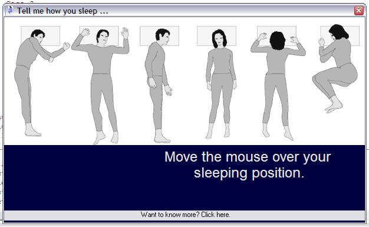

## Sleep positions

### Description

Tell me how you sleep and I will tell you who you are A scientist claims to have discovered a direct link between people's favourite sleeping position and their personality. Here's how to find out for yourself. Zip 36KB - Paul Turcksin
 
### More Info
 

             |
---                |---
**Submitted On**   |2007-09-13 08:00:02
**By**             |[Paul Turcksin](https://github.com/Planet-Source-Code/PSCIndex/blob/master/ByAuthor/paul-turcksin.md)
**Level**          |Beginner
**User Rating**    |5.0 (20 globes from 4 users)
**Compatibility**  |VB 6\.0
**Category**       |[Complete Applications](https://github.com/Planet-Source-Code/PSCIndex/blob/master/ByCategory/complete-applications__1-27.md)
**World**          |[Visual Basic](https://github.com/Planet-Source-Code/PSCIndex/blob/master/ByWorld/visual-basic.md)
**Archive File**   |[Sleep\_posi2083189132007\.zip](https://github.com/Planet-Source-Code/paul-turcksin-sleep-positions__1-69322/archive/master.zip)

